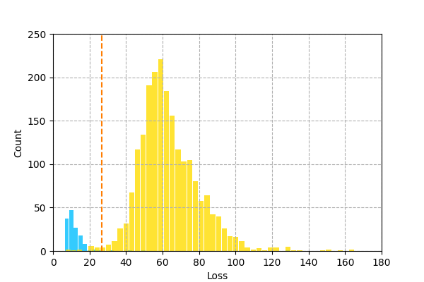

# Anomaly Detection on Electrocardiogram using LSTM Autoencoder

## Introduction

An *electrocardiogram*, ECG, is a test to verify the nomality of a heart function by measuring the waveform of electrical signals generated by each heartbeat.
Here, we use an *autoencoder* to reconstrcut these waveforms and build a model to detect abnormal heartbeats.
This example is based on [*Time Series Anomaly Detection using LSTM Autoencoders with PyTorch in Python*](https://curiousily.com/posts/time-series-anomaly-detection-using-lstm-autoencoder-with-pytorch-in-python/).

## Dataset

The `ECG5000` is a *time series* dataset which contains 5,000 sequences with 140 timesteps, including actual cases of patients with cardiac diseases[^ECG5000].
In particular, the number of features is 1 for basic ECG data.
The original dataset was divided into two parts, training and test, but we combined and shuffled these two parts into one dataset.
Then we split the dataset into 85%, 10%, and 5% for training, validation, and test.

Each sequence corresponds to a single heartbeat from a single patient.
The dataset contains the following five patterns of hearbeats:

- Normal (N)
- R-on-T Premature Ventricular Contraction (R-on-T)
- Premature Ventricular Contraction (PVC)
- Supra-ventricular Premature or Ectopic Beat (SP)
- Unclassified Beat (UB)

The normal samples are the most common at about 58%.

## LSTM Autoencoder

The autoencoder learns to reconstruct the output from the input, by minimizing *reconstruction error*. In particular, we use L1 loss as the reconstruction error here.
During learning, the hidden layer of the autoencder represents the subject in a lower dimension than the input. This is a *feature extraction* of the autoencoder.
Since this autoencoder handles time series sequences, we employs two *long short-term memory*, LSTM layers as the encoder and decoder.

## Anomaly Detection

For anomaly detection, we train only with normal patterns.
When abonormal patterns are input to a model trained with only normal patterns, the reconstruction error is expected to be larger than with normal patterns.
Thus, the problem is handled as a binary classification.
The model detects anomalies from input data by determining a threshold of the reconstruction error that statistically separates normal from abnormal patterns.

## Results

A histogram of the reconstruction errors obtained as a result of the prediction for the test set is shown in Figure 1.

**Figure 1. A histogram of the reconstruction errors in predictions.**

For the threshold value, we used 26.834 that separates the validation set by 98.5%. The dashed line in the figure indicates the threshold value.
It can be seen that normal and abnormal patterns are well discriminated.
The precision of anomaly detection was 0.998, and recall was 0.992.

Since we want to avoid overlooking abonrmalities in health checks, it may be considered to define the threshold value to make the recall higher.

[^ECG5000]: A.L. Goldberger et al., *PhysioBank, PhysioToolkit, and PhysioNet: Components of a New Research Resource for Complex Physiologic Signals*, **Circulation**, 2000.
